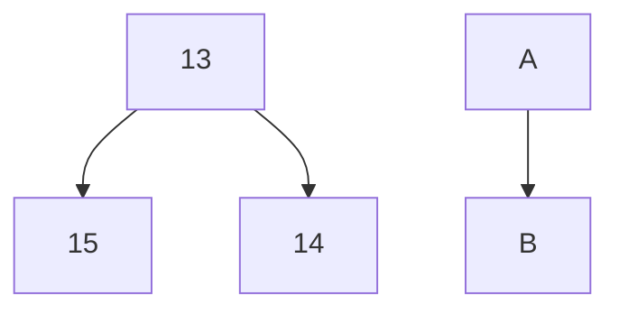
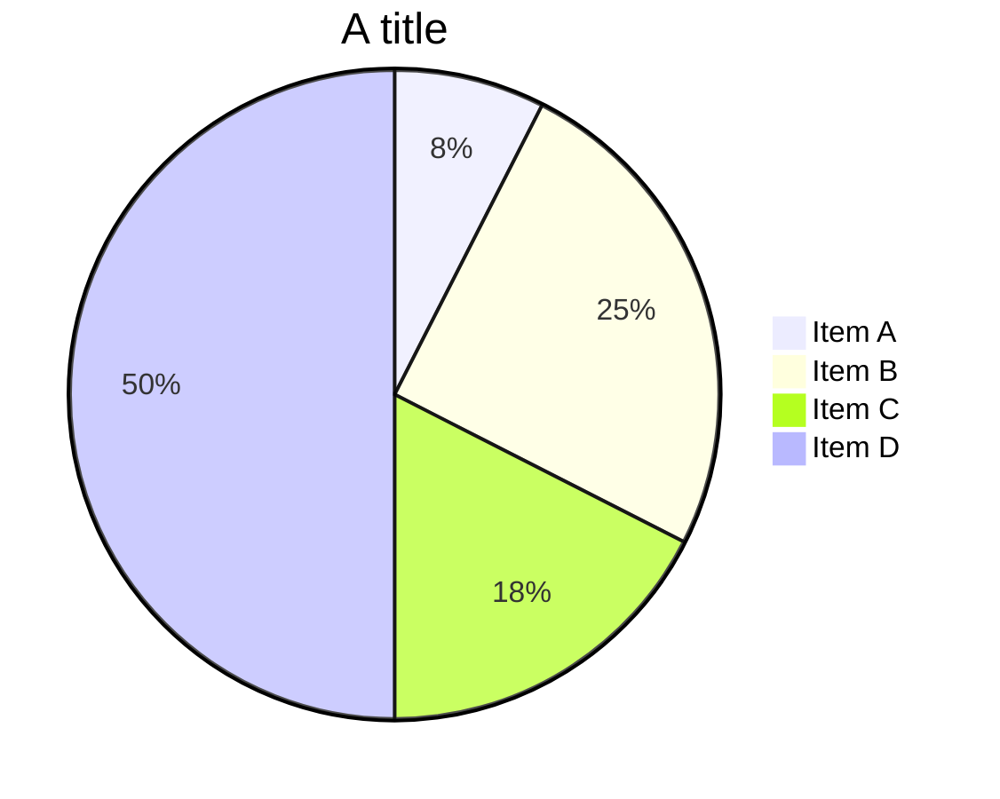
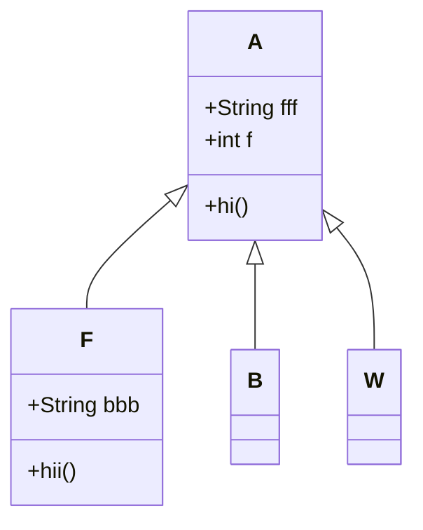
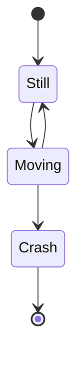

# 第一周学习日志

北大学号：1800018615

清华课程学号：P20243192

## Markdown

### 画图(Typora)

有向图(mermaid)



序列(sequence)

```sequence
A->B:OK?
Note left of A:L
note right of B:R
B->A:OK.
```

流程图(flow)

```flow
st=>start: start
op=>operation: Mo 
cond=>condition: Yes or NO?
e=>end
st->op->cond
cond(yes)->e
cond(no)->op
```

甘特图(mermaid)

```mermaid
gantt
dateformat YYYY-MM-DD
title daily life with trading
section research
Learning:done, d1,2021-01-31,2021-02-23
Programming: active,d2 2021-02-23,2021-03-31
section trading
Python:done,t1,after d1,72h
C++:crit,active,after t1,3w

```

饼图(mermaid)



ClassDiagram(mermaid)



StateDiagram(mermaid)




### 插入公式

*分享方法*：在`Python`中使用`latexify`将函数**生成公式**

```python
import latexify
@latexify.with_latex
def f_1(x):
    if x==1:
        return 1
    elif x==2:
        return 2
    else:
        return f_1(x-1)+f_1(x-2)

print(f_1)
#Output:\mathrm{f_1}(x)\triangleq \left\{ \begin{array}{ll} 1, & \mathrm{if} \ x=1 \\ 2, & \mathrm{if} \ x=2 \\ \mathrm{f_1}\left(x - 1\right) + \mathrm{f_1}\left(x - 2\right), & \mathrm{otherwise} \end{array} \right.
```

$$
\mathrm{f_1}(x)\triangleq \left\{ \begin{array}{ll} 1, & \mathrm{if} \ x=1 \\ 2, & \mathrm{if} \ x=2 \\ \mathrm{f_1}\left(x - 1\right) + \mathrm{f_1}\left(x - 2\right), & \mathrm{otherwise} \end{array} \right.
$$

### 插入图片

与传统的线性回归和多项式回归相比，符号回归无需事先指定目标函数的形式和参数,函数的形式和参数均在回归的过程中确定。因此符号回归具有更广泛的应用范围。


### 插入表格

| for creating a table, the shortcut key is `option`+`command`+`T` |      |
| ------------------------------------------------------------ | ---- |
|                                                              |      |

## Git

在Mac上在某一文件夹下打开终端窗口，或定位到该文件夹，新建本地仓库（repo）命令为：

```
git init
```

此时该文件夹下应多出.git文件夹，默认为隐藏的，显示隐藏文件的命令为`defaults write com.apple.finder AppleShowAllFiles -bool true `，不想显示则将`true`改为`false`

配置个人信息的命令为：

```
git config user.name xingming
git config user.email email
```

使用`git add 文件名`将文件添加到暂存区，`git commit 文件名`将文件添加到本地仓库；`commit`后写注释，按`i`开始添加注释，空的提交将被终止；添加完成后按`esc`退出添加，输入`:wq`保存并退出。

当然，直接在Github上操作也很方便

## 量化交易

课堂实验非常有趣，必须称赞！同时也感觉到，即便是已经知道答案与套路的问题（三门），在短时间内仍然不能有效地反应过来；职业天花板不会高了。

伴随本次量化交易课程而来的，课程之外的阅读中遇到一段有意思的话：

> 他们很少持仓过夜，因为需要付出代价。他们会在一天之内数次猜测他们所关注的股票在未来几个小时内的涨跌。
>
> 我永远无法理解人们是如何得到这类结论的，它的不可预测性与猜测下一个在转角出现的人是男是女有得一比。据我观察，如果以10美元买进、11美元卖出，下个星期以24美元买进、25美元卖出，再下个星期以39美元买进、40美元卖出，日间交易者就认为自己是成功的。如果你看不到其中的缺陷——股价上涨了30美元，交易者却只赚到了3美元——那么你或许没有必要再看本书后面的内容了。

这一段话来自霍华德·马克斯《投资最重要的事》，最开始看到这段话心里是不大舒服的，因为有些策略确实会在一天之内多次产生交易信号，所以感觉自己就是那个交易者；虽然不爽，这段话是有启发的。因为换个角度，如果再有另一个交易者，在11美元买入，下星期24美元卖出，再25美元买入，再下个星期39美元卖出，那这个交易者可以说是比较成功的了。而如果这个故事变得更加有趣，市场上再多一个不成功的交易员，10美元买进、9美元卖出，24美元买进、23美元卖出，39美元买进、38美元卖出，那么先前成功的交易者的利润又可以扩大了，甚至高于一直持仓的投资者。

我认为这个思想例子展开是蛮有意思的，很直观地展示出调仓的成本：如果一个资产确定性地一直上涨，那么频繁交易只会带来损失。在该例子中，成功交易员获得的利润需要同行的衬托，买卖是同时发生的，在这个某证券从10美元涨至40美元的世界里，有人能赚到33美元，而有人要亏3美元。~~还有人为赚3美元而感到成功。~~

必须要提的$\alpha$：
$$
r_P=\beta_P* r_\beta+\alpha_P+\epsilon_P 
$$
曾看过桥水的一篇文章，记得其将$\alpha$看作资产管理者提供的价值所在，我觉得非常有趣；这时的$r_\beta$指的是该类别资产相对于无风险收益的超额回报率，$\beta$像指代一种风险资产，$\beta_P$则为资产组合$P$对$\beta$的因子暴露。在业绩归因时，除了大类资产的角度，还有其他因子也被用于解释业绩，比如SMB、HML等。对规模因子构建的投资组合，对SMB应该是不存在超额收益的，但可以对市场组合存在；换言之，一个发现规模效应、并以此构建投资策略的基金经理可以产生对市场组合的超额收益，而他所采用的策略有很多的研究支持其为有效的。个人是感觉，一个基金经理在任职期间获得$\alpha$是一种能力的认可；在他退休之后，他的策略公开以后，该策略能经得住检验，成为别的策略归因时的$\beta$，则更是一种投资能力的确认与“盖棺论定”。

对巴菲特投资业绩进行归因[^1]，6因子模型仍不能完全解释其超额收益:

[^2]


[^1]: •Andrea Frazzini，David G. Kabiller，Lasse Heje Pedersen, 2013, Buffett's Alpha. National Bureau of Economic Research working paper, w19681. See also, •“Buffett’s Alpha,” Financial Analysts Journal, 2018, vol 74(4), pages 35-55.
[^2]: MKT:Market Return, SMB: Small Minus Big, HML: High Minus Low, UMD: Up Minus Down 动量, BAB: Betting Against Beta $\beta$套利因子，指低Beta股票收益率与高Beta股票收益率之差, QMJ: Quality Minus Junk 优质股票（高利润、高增长、高分红等指标综合度量）与垃圾股收益之差。

本次交易课程的课件当中有一节选择自己的交易哲学，其实对于理论驱动和数据驱动的具体定义还有些疑问；如果其区别类似于牛顿与开普勒，那于专业于个人目前都偏向于数据驱动；不过仍有些区分不清楚，期待下一次课！
