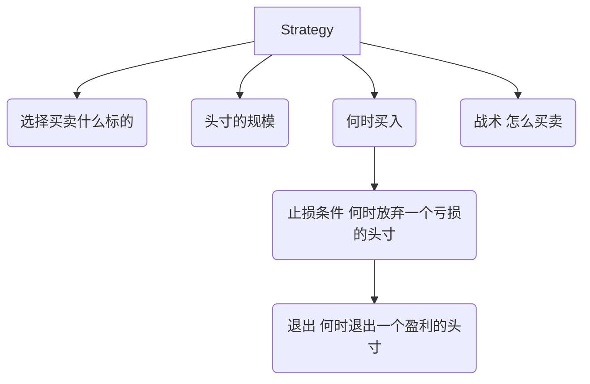
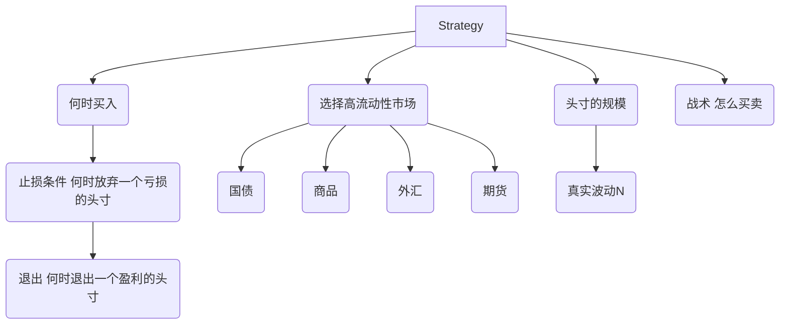

# 第三周学习日志

北大学号：1800018615

清华课程学号：P20243192

## 资源分享

> 中文Quant相关资源索引：https://github.com/physercoe/awesome-quant

## Python部分

分享一个凯利公式作业的交互图表，使用plotly，非常方便；streamlit也很好，同时将plotly转移也很方便。

> plotly doc: https://plotly.com/python/getting-started/#installation

```python
#调包====================================
import matplotlib.pyplot as plt
import seaborn as sns
import plotly 
import latexify
import datetime
import numpy as np
import pandas as pd

import plotly.graph_objects as go
from ipywidgets import widgets 
#调包====================================

#data part====================================
def gen_data(series_number,test_number,p,b,f,initial=100):
    '''
    series_number: int
    test_number: int, for every series
    p: float, winning probability 
    b: float or int, win/lose 
    f: float, percentage of initial
    '''
    total_shape=(test_number,series_number)
    
    ret=np.random.binomial(1,p,total_shape)*(1+b)*f-f #if 1, b*f; 0, -f
    ret_df=pd.DataFrame(np.vstack([np.zeros((1,total_shape[1])),ret]))
    nav_df=((1+ret_df).cumprod())*initial
    return nav_df 

nav_df=gen_data(50,100,0.55,1,0.1)
#data part====================================

#交互图表控件====================================
series_list=[i for i in range(100)]
text_list=[(1+i)*100 for i in range(5)]

series_slider=widgets.SelectionSlider(options=series_list,value=series_list[len(series_list)//2],description='I: ')
text_slider=widgets.SelectionSlider(options=text_list,value=100,description='n: ')
p_list=widgets.SelectionSlider(options=np.arange(0,1.01,0.01),value=0.55,description='p: ')

container_=widgets.HBox(children=[series_slider,text_slider,p_list])

b_input=widgets.Text(value='1',description='b: ')
f_input=widgets.Text(value='0.1',description='f: ')
initial_input=widgets.Text(value='100',description='initial: ')

container_2=widgets.HBox([b_input,f_input,initial_input])
#交互图表控件====================================

#response====================================
def response_(change):
    param_dict=dict(series_number=series_slider.value ,
                    test_number=text_slider.value,
                    p=p_list.value,
                    b=eval(b_input.value),
                    f=eval(f_input.value),
                    initial=eval(initial_input.value))
    nav_df=gen_data(**param_dict)
    
    with g1.batch_update():
        g1.data=()
        g1.layout.yaxis.title='NAV'
        g1.layout.xaxis.title='Test Times'
        g1.add_trace(go.Scatter(y=nav_df.mean(axis=1),name='Average',opacity=1))
        g1.add_traces([go.Scatter(y=nav_df[i],opacity=0.2) for i in range(series_slider.value)])
        #for i in range(series_slider.value):
        #    g1.add_trace(go.Scatter(y=nav_df[i],opacity=0.2))
        
        
series_slider.observe(response_,names='value')
text_slider.observe(response_,names='value')
p_list.observe(response_,names='value')
b_input.observe(response_,names='value')
f_input.observe(response_,names='value')
initial_input.observe(response_,names='value')
#response====================================

#构建一个图表====================================
g1=go.FigureWidget(
                  layout=go.Layout(title=dict(text='NAV')))
g1.add_trace(go.Scatter(y=nav_df.mean(axis=1),name='Average',opacity=1))
g1.add_traces([go.Scatter(y=nav_df[series_],opacity=0.2) for series_ in nav_df.columns])
#构建一个图表====================================

#加入互动控件，互动图表完成
widgets.VBox([container_,container_2,g1])
```


## 量化交易部分




### 海龟交易策略



$$
N=\frac{(19*PDN+TR)}{20}
$$

$$
PDN=前一日N值\\
TR=当日真实波动\\
真实波动=\max(H-L,H-PDC,PDC-L)\\
其中：\\
H=当日最高价\\
L=当日最低价\\
PDC=前一日收盘价
$$

$$
头寸规模单位=\frac{账户的1\%}{N*每一最小交易单位资金(1手股票)}
$$

