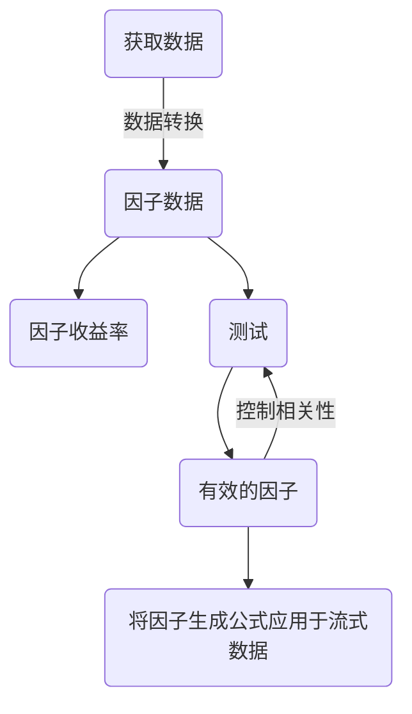

# 第四周学习日志

北大学号：1800018615

清华课程学号：P20243192


## 量化交易部分

选股、择时可以理解成权重在截面、时间序列的表现；选股、择时都是对证券集权重进行调整，给的权重大是选股，给的权重变大是择时；而权重可以和因子相关。

通过一些很好的因子，去解释共同基金的业绩，挑选出合适的基金，也可以是一种策略。

对于择时，TM模型为：
$$
r_{p,t}=\alpha_p+\beta_pr_{m,t}+\gamma_pr_{m,t}^2+\epsilon_{p,t}
$$
往CAPM模型中加入二次项；其理由直观如下，市场好时$\beta$更大，收益率也更大；市场不好时则相反。从而，是** convex function** 


另一个择时模型是HM模型：
$$
r_{p,t}=\alpha_p+\beta_pr_{m,t}+\gamma_pr_{m,t}^*+\epsilon_{p,t}\\
r_{m,t}^*=I\{r_{m,t}>0\}r_{m,t}
$$

## 金融大数据部分



```python
#读取聚宽股票价格、基本面数据的一个示例
from jqdatasdk import * 
import datetime
import pandas as pd

auth_name=input('usr:')
auth_psw=input('password:')
auth(auth_name,auth_psw)
#查看剩余额度
print(get_query_count())

today_=datetime.datetime.today()
#更新stock_list
type_=input('证券类别：')
stock_list=get_all_securities(types=[type_], date=today_)
stock_list.to_csv('A_%s.csv'%type_)
stock_list=pd.read_csv('A_%s.csv'%type_,index_col=0)
stock_list_=stock_list.index.tolist()
print('证券数量为%d'%len(stock_list_))
if type_=='stock':
    price_count=input('更新长度(不输入则默认长度)')
    if price_count=='':
        price_count=get_query_count()['spare']//10000
        if price_count>200:
            price_count=200
    #调用JQData--1
    frequency_=input('读取价格数据的频率：'+"现在支持'Xd','Xm', 'daily'(等同于'1d'), 'minute'(等同于'1m')；默认daily'")
    if frequency_=='':
        frequency_='daily'
    fq=input('复权选项，默认前复权:pre;None: 不复权, 返回实际价格;post: 后复权')
    if fq=='':
        fq='pre'
    
    #原始价格一张日频表
    try:
        stock_price_hist=pd.read_csv('A_%s_price.csv'%type_,
                             dtype={'time': 'str',
                                     'code': 'str',
                                    'open': 'float64',
                                     'close': 'float64',
                                     'high': 'float64',
                                     'low': 'float64',
                                     'volume': 'float64',
                                     'money': 'float64'},
                            parse_dates=['time'])#将time读入成时间格式
        new_days=(today_-stock_price_hist.time.max()).days
        if new_days==0:
            new_days=1
        print('开始获取...')
        stock_price_concat=get_price(security=stock_list_,
                           panel=False,
                           end_date=stock_price_hist.time.min(),#上次读取的最早日期
                           count=price_count,
                           frequency=frequency_,
                           fq=fq,
                           skip_paused=False
                          )
        stock_price_concat2=get_price(security=stock_list_,
                           panel=False,
                        end_date=today_,
                           count=new_days,#上次读取的最晚日期
                           frequency=frequency_,
                           fq=fq,
                           skip_paused=False
                          )
        stock_df=pd.concat([stock_price_hist,stock_price_concat,stock_price_concat2]) 
        stock_df=stock_df.drop_duplicates()
    except FileNotFoundError:
        stock_df=get_price(security=stock_list_,
                           panel=False,
                           end_date=today_,
                           count=price_count,
                           frequency=frequency_,
                           fq=fq,
                           skip_paused=False
                          )
    
    print('更新后价格数据区间为:%s至%s'%(stock_df.time.min(),stock_df.time.max()))
    stock_df.to_csv('A_%s_price.csv'%type_,index=False)
    stock_df=pd.read_csv('A_%s_price.csv'%type_,dtype={'time': 'str',
                                     'code': 'str',
                                    'open': 'float64',
                                     'close': 'float64',
                                     'high': 'float64',
                                     'low': 'float64',
                                     'volume': 'float64',
                                     'money': 'float64'},
                     parse_dates=['time'])
    #取至月频
    resample_=input( "取频率，默认月频；‘M’, ‘A’, ‘Q’, ‘BM’, ‘BA’, ‘BQ’, and ‘W’ ")
    if resample_=='':
        resample_='M'
    close_df=stock_df.pivot(columns='code',index='time',values='close')
    close_df_M=close_df.resample(resample_).last()
    #JQData Query
    #估值、三张表、指标
    q=query(valuation,income,balance,cash_flow,indicator).filter(valuation.code.in_(stock_list_),
                                                             income.code.in_(stock_list_),
                                                            balance.code.in_(stock_list_),
                                                            cash_flow.code.in_(stock_list_),
                                                            indicator.code.in_(stock_list_))
    import os 
    import warnings
    warnings.filterwarnings("ignore")
    os.makedirs('./%s_fundamentals/'%type_,exist_ok=True)
    csv_list=os.listdir('./%s_fundamentals/'%type_)
    if '.ipynb_checkpoints' in csv_list:
        csv_list.remove('.ipynb_checkpoints')
    if '.DS_Store' in csv_list:
        csv_list.remove('.DS_Store')
    date_hist_list=list(map(lambda x:x[:10],csv_list)) 
    date_hist_list.sort()
    print('开始获取基本面数据...')
    if len(date_hist_list)!=0:
        for date_ in close_df_M.index[close_df_M.index<pd.to_datetime(min(date_hist_list))]:
        #每循环调用一次JQData
            fundamentals_df=get_fundamentals(query_object=q,date=date_)
            fundamentals_df.to_csv('./%s_fundamentals/%s.csv'%(type_,date_.strftime('%Y-%m-%d')),index=False)
        for date_ in close_df_M.index[close_df_M.index>pd.to_datetime(max(date_hist_list))]:
        #每循环调用一次JQData
            fundamentals_df=get_fundamentals(query_object=q,date=date_)
            fundamentals_df.to_csv('./%s_fundamentals/%s.csv'%(type_,date_.strftime('%Y-%m-%d')),index=False)
    else:
        for date_ in close_df_M.index:
            #每循环调用一次JQData
            fundamentals_df=get_fundamentals(query_object=q,date=date_)
            fundamentals_df.to_csv('./%s_fundamentals/%s.csv'%(type_,date_.strftime('%Y-%m-%d')),index=False)
    print('完成')
    logout()
else:
    print('暂时没写%s的代码...'%s)
    logout()
```

