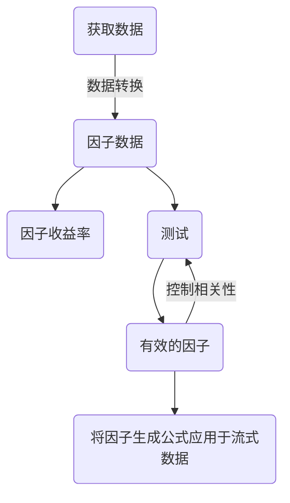

# 第四周学习日志

北大学号：1800018615

清华课程学号：P20243192


## 量化交易部分

构建BAB因子：


## 金融大数据部分



本次学习在`jupyter notebook`中使用`%%sql`受益良多

```python
%load_ext sql
%sql sqlite://
  
%%sql drop table if exists product;
create table product(
       pname        varchar primary key, -- name of the product
       price        money,               -- price of the product
       category     varchar,             -- category
       manufacturer varchar NOT NULL     -- manufacturer
);
insert into product values('Gizmo', 19.99, 'Gadgets', 'GizmoWorks');
insert into product values('PowerGizmo', 29.99, 'Gadgets', 'GizmoWorks');
insert into product values('SingleTouch', 149.99, 'Photography', 'Canon');
insert into product values('MultiTouch', 203.99, 'Household', 'Hitachi');

%sql select * from product;

%%sql
SELECT * FROM Product;

SELECT
    p.manufacturer, p.pname, p.price
FROM 
    (SELECT distinct p0.Manufacturer
     FROM Product p0
     WHERE p0.price < 20.00) cp, -- this is a nested query!
    Product p
WHERE 
    p.manufacturer = cp.manufacturer and p.price > 20.00
  
%%sql
-- sometimes we want to order the results.
-- can order like so, each component individually
SELECT   price, manufacturer
FROM     Product
-- the order is "dictionary order" in the clause.
ORDER BY   manufacturer ASC, price DESC

%%sql
drop table if exists product; -- This needs to be dropped if exists, see why further down!
drop table if exists company;
create table company (
    cname varchar primary key, -- company name uniquely identifies the company.
    stockprice money, -- stock price is in money 
    country varchar); -- country is just a string
insert into company values ('GizmoWorks', 25.0, 'USA');
insert into company values ('Canon', 65.0, 'Japan');
insert into company values ('Hitachi', 15.0, 'Japan');

%%sql -- duplicate answer
SELECT Country
FROM Product, Company
WHERE  Manufacturer=CName AND Category='Gadgets';
```

