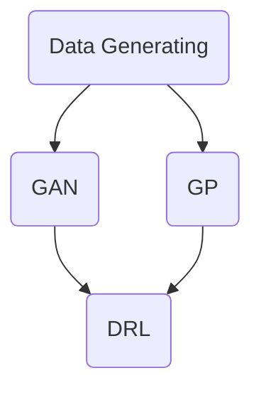

# 第四周学习日志

北大学号：1800018615

清华课程学号：P20243192


## 期中大作业

同学们的策略都比较相似，希望后半学期我们能学到超出条件选股的方法

杜邦分析拆分ROE优化选股条件的策略很有启发，对于有很强逻辑基础支撑的因子，这种优化可能就是$\alpha$来源；

对于效果很好的策略，可以进一步检查持仓交易记录；

BAB因子做的还是比较粗糙的，不过15年复利26%的策略以前也没试过；对于有效的因子，算出因子收益率后，可以对股票基金进行业绩归因，找出$\alpha$最大的基金，再投资这些基金也是一种策略；我感觉因为有基金经理的因素在，长期有$\alpha$的基金经理更可能保持下去；六因子归因后巴菲特的$\alpha$没剩多少，但彼得林奇的业绩仍有很大一部分无法解释；如果能把彼得林奇的研究方法论程序化，应当也是一种策略；

单看2020年，我有[4倍夏普的策略，用的XGBoost](https://www.joinquant.com/view/community/detail/4408bf3592a018521d1182a38ec8987d)；不过社区分享的代码有些问题，应该没问题的代码在下面分享；回测时间非常长，可以在一创聚宽平台测，默认`python2`；

对于策略评价，除了平台自带的，还可以使用`pyfolio`(`pip install pyfolio`)，最简单的只用收益率数据就足够，用`help()`可以看到很详细的说明。

```python
# 导入函数库
from jqdata import *
from jqfactor import *
import numpy as np
import pandas as pd 
import time
import xgboost as xgb
import statsmodels.api as sm
import random
from sklearn.metrics import recall_score,precision_score,accuracy_score
from sklearn.model_selection import GridSearchCV
import warnings
#自定义因子可能更慢
warnings.filterwarnings('ignore')

# 初始化函数，设定要操作的股票、基准等等
def initialize(context):
    #stocks_hs300=get_index_stocks('000300.XSHG')
    ##医药生物
    #stocks_medicine=get_industry_stocks('801150')
    ##白酒
    #stocks_baijiu=get_industry_stocks('851231')
    # 定义一个全局变量, 保存要操作的股票
    #g.stocks=list(set(stocks_baijiu)&set(stocks_hs300))+list(set(stocks_medicine)&set(stocks_hs300))
    g.stocks=get_index_stocks('000300.XSHG')
    g.target_stocks=[]
    g.recording={}
    g.buy_time={}
    for stock in g.target_stocks:
        g.recording[stock]=0
        g.buy_time[stock]=0
    # 设定沪深300作为基准
    set_benchmark('000300.XSHG')
    #公用变量
    g.factor_list=[BETA(),LOG_CIRCU_MARKET_CAP(),MA5(),ATR14(),ALPHA014(),BP(),SP(),GROSS_PROFITABILITY(),ROE_3Y(),MOM_RETURN_1M()]
    g.factor_name=[factor.name for factor in g.factor_list]
    print('因子总数：%s ，名称为：%s' %(len(g.factor_name),g.factor_name))
    g.cv_params = {'max_depth': [3,6,9], 
             'n_estimators': [10,50,100,200]}
    g.ind_params = {'learning_rate': 0.1,
              "min_samples_leaf":[10],
              'seed':100, 'objective': 'binary:logistic'}
    # 开启动态复权模式(真实价格)
    #set_option('use_real_price', True)
    #日频
    #run_daily(stock_select,time='6:30',reference_security='000300.XSHG')
    #run_daily(timing, time='open',reference_security='000300.XSHG')
    #run_daily(evaluate,time='close',reference_security='000300.XSHG')
    #g.count_day=2
    #周频
    #run_weekly(stock_select,1,time='6:30',reference_security='000300.XSHG')
    #run_weekly(timing,1, time='open',reference_security='000300.XSHG')
    #run_weekly(evaluate,-1,time='close',reference_security='000300.XSHG')
    #g.count_day=6
    #月频
    run_monthly(stock_select,1,time='6:30',reference_security='000300.XSHG')
    run_monthly(update_stocks, 1, time='open',reference_security='000300.XSHG')
    #控制择时发生在更新后
    g.timing_=False
    #使用handle_data(context, data)
    #run_daily(timing, time='every_bar',reference_security='000300.XSHG')
    run_monthly(evaluate,-1,time='close',reference_security='000300.XSHG')
    g.count_day=31
    g.train_day_amount=90
    
def stock_select(context):
    print('='*30)
    print('月初选股')
    factor_list=g.factor_list
    factor_name=g.factor_name
    cv_params=g.cv_params
    ind_params=g.ind_params
    st=time.time()
    end_date=context.previous_date-datetime.timedelta(1)
    num_traceback_day=200*3 
    start_date=end_date-datetime.timedelta(num_traceback_day)
    #--------------------------------------------------------
    #此处可生成不同时间跨度的xgb模型并训练
    #计算count_day-1的收益率
    count_day=g.count_day
    x_train,y_train=get_train_data(factor_list,start_date,end_date,count_day)
    et=time.time()
    print('训练获取数据共：%.1f 秒'%(et-st))
    st=time.time()
    xgb_cv=model_train(x_train,y_train,cv_params,ind_params,'roc_auc')
    et=time.time()
    print('训练模型共：%.1f 秒'%(et-st))
    xgb_model_=xgb_cv.best_estimator_
    g.xgb_model_=xgb_model_
    log.info('训练集上模型表现：')
    model_evaluate(xgb_model_,y_true=y_train,x=x_train)
    value_df=get_test_x(factor_list,date_=context.previous_date)
    xgb_factor=get_xgb_factor(value_df,xgb_model_)
    #--------------------------------------------------------
    #将不同xgb_factor组合
    #
    #生成股票列表
    g.target_stocks=list(get_target_stocks(xgb_factor))
    for stock in g.target_stocks:
        g.recording[stock]=0
        g.buy_time[stock]=0
    print('='*30) 

def update_stocks(context):
    #根据列表更新
    stock_list=g.target_stocks
    rebalance_position(context, stock_list)
    for stock in context.portfolio.positions.keys():
        g.recording[stock]=context.portfolio.positions[stock].price
        g.buy_time[stock]=1
    g.timing_=True

# 每个单位时间(如果按天回测,则每天调用一次,如果按分钟,则每分钟调用一次)调用一次
def handle_data(context, data):
    if g.timing_ :
        stock_list=g.target_stocks
        recording=g.recording
        buy_time=g.buy_time
        for stock in stock_list:
            price_df=get_price(stock,end_date=context.previous_date,count=20,fields=['high','low','close'])
            atr=ATR(TR(price_df)).iloc[-1]
            turtle(context,data,stock,price_df,buy_time,recording,atr)

def evaluate(context):
    x_new,y_new=get_new_data(g.factor_list,context.current_dt,count=g.count_day)
    log.info('测试集上模型表现：')
    model_evaluate(g.xgb_model_,y_true=y_new,x=x_new)
    
'''
-----------------自定义函数-------------------------------
'''
#训练部分
def get_train_x(factor_list,date_):
    #聚宽函数取因子值，dict，factor.name为键，值为dataframe
    values = calc_factors(g.stocks,
                factor_list,
                start_date=date_,
                end_date=date_)
    #time_list_=list(values[factor_list[0].name].index)
    value_df=values[factor_list[0].name].iloc[0]
    for factor in factor_list[1:]:
        value_df_=values[factor.name].iloc[0]
        value_df=pd.concat([value_df,value_df_],axis=1)
        
    #value_df每一column为一个因子在date_上横截面因子值，index为不同证券代码
    value_df=value_df.dropna(axis=0)
    return value_df

def get_train_y(end_date,count):
    #取用价格数据，如收盘价
    price_df=get_price(g.stocks,end_date=end_date,count=count,fields=['close'])['close']
   
    def return_cal(price_df,period): 
        return price_df.pct_change(period)
    #根据标注规则，标注分类
    def label(price_df):
        return_df=return_cal(price_df,count-1)#count-1日(交易日)收益率
        #标注规则，此处是count-1日收益率高于70%分为正类，低于70%分为负类，其余标为nan
        label_df=return_df.apply(lambda row: row.map(lambda x: 1 if x>row.quantile(0.7) else(0 if x<row.quantile(0.3) else np.nan)) ,axis=1)
        #取end_date结果
        label_=label_df.iloc[-1]
        #返回y_start_date,获取y_start_date日因子数据
        y_start_date=label_df.index[0]
        return label_,y_start_date
        #return label_
    
    #label_每一index为一个证券代码,label_为Series
    label_,y_start_date=label(price_df)
    #label_=label(price_df)
    label_=label_.dropna()
    
    return label_,y_start_date
    #return label_

def train_concat(value_df,label_):
    #取有效数据的交集
    stocks_=set(value_df.index) & set(label_.index)
    
    #转为numpy array
    train_y=np.array(label_[stocks_]).reshape(-1,1)
    train_x=np.array(value_df.loc[stocks_])
    return train_x,train_y

def get_train_data(factor_list,start_date,end_date,count):
    '''
    factor_list: 定义的每个因子，list类型
    count: 计算回报率时，计算count-1日(交易日)收益率
    '''
    def get_calendar(start_date,end_date):
        return get_price('000300.XSHG',start_date=start_date,end_date=end_date,fields=['close'])['close'].index
    
    #从calendar中随机选取k天进行训练
    calendar_=random.sample(get_calendar(start_date,end_date),k=g.train_day_amount)
    for date_ in calendar_:
        label_,y_start_date=get_train_y(date_,count)
        value_df=get_train_x(factor_list,y_start_date)
        #value_df=get_train_x(factor_list,date_)
        #label_=get_train_y(date_,count)
        train_x,train_y=train_concat(value_df,label_)
        if date_ == calendar_[0]:
            x_train=train_x
            y_train=train_y
        else:
            x_train=np.vstack([x_train,train_x])
            y_train=np.vstack([y_train,train_y])
    
    y_train=y_train.reshape(y_train.shape[0],)
    
    return x_train,y_train

def model_train(x_train,y_train,cv_params,ind_params,scoring):
    '''
    cv_params：网格搜索调优的参数
    ind_params： 初始化的参数
    socring： 网格搜索的scoring参数
    '''
    xgb_cv = GridSearchCV(xgb.XGBClassifier(**ind_params), 
                            cv_params, 
                            cv = 5, n_jobs = -1,
                     scoring='roc_auc') 
    print('训练样本数：%d' %len(x_train))
    xgb_cv.fit(x_train,y_train)
    return xgb_cv
    
#模型评价部分
def model_evaluate(xgb_model,y_true,x):
    #因子重要性
    print(str(g.factor_name)+'\n'+str(xgb_model.feature_importances_))
    y_pred=xgb_model.predict(x)
    print('recall: %.2f' %recall_score(y_true,y_pred))
    print('precision: %.2f' %precision_score(y_true,y_pred))
    print('accuracy: %.2f' %accuracy_score(y_true,y_pred))
    
def get_new_data(factor_list,end_date,count):
    '''
    factor_list: 定义的每个因子，list类型
    '''
    
    price_df=get_price(g.stocks,count=count,end_date=end_date,fields=['close'])['close'] 
    
    def return_cal(price_df,period): 
        return price_df.pct_change(period)
    #根据标注规则，标注分类
    def label(price_df):
        return_df=return_cal(price_df,count-1)#count-1日(交易日)收益率
        #标注规则，此处是count-1日收益率高于70%分为正类，低于70%分为负类，其余标为nan
        label_df=return_df.apply(lambda row: row.map(lambda x: 1 if x>row.quantile(0.7) else(0 if x<row.quantile(0.3) else np.nan)) ,axis=1)
        #取end_date结果
        label_=label_df.iloc[-1]
        y_start_date=label_df.index[0]
        return label_,y_start_date
        #return label_
        
    
    #label_每一index为一个证券代码,label_为Series
    label_,y_start_date=label(price_df)
    label_=label_.dropna()
    
    date_=y_start_date
    #聚宽函数取因子值，dict，factor.name为键，值为dataframe
    values = calc_factors(g.stocks,
                factor_list,
                start_date=date_,
                end_date=date_)
    #time_list_=list(values[factor_list[0].name].index)
    value_df=values[factor_list[0].name].iloc[0]
    for factor in factor_list[1:]:
        value_df_=values[factor.name].iloc[0]
        value_df=pd.concat([value_df,value_df_],axis=1)
        
    #value_df每一column为一个因子在date_上横截面因子值，index为不同证券代码
    value_df=value_df.dropna(axis=0)
    #取有效数据的交集
    stocks_=set(value_df.index) & set(label_.index)
    
    #转为numpy array
    y_new=np.array(label_[stocks_]).reshape(-1,1)
    x_new=np.array(value_df.loc[stocks_])
    return x_new,y_new


#接收新数据进行选股
#接收新数据
def get_test_x(factor_list,date_):
    #聚宽函数取因子值，dict，factor.name为键，值为dataframe
    values = calc_factors(g.stocks,
                factor_list,
                start_date=date_,
                end_date=date_)
    #time_list_=list(values[factor_list[0].name].index)
    value_df=values[factor_list[0].name].iloc[0]
    for factor in factor_list[1:]:
        value_df_=values[factor.name].iloc[0]
        value_df=pd.concat([value_df,value_df_],axis=1)
        
    #value_df每一column为一个因子在date_上横截面因子值，index为不同证券代码
    #日频情况下，每次新接收数据仅一日
    value_df=value_df.dropna(axis=0)
    
    return value_df

#根据新数据选股
def get_xgb_factor(value_df,xgb_model):
    #label=1(涨幅靠前)的概率
    value_df['label_pred_proba']=xgb_model.predict_proba(value_df.values)[:,1]
    xgb_factor=value_df.label_pred_proba
    value_df.drop(labels=['label_pred_proba'],axis=1,inplace=True)
    
    return xgb_factor

def get_target_stocks(xgb_factor):
    
    #预测概率最大的股票，选前10只
    target_stocks=(xgb_factor.sort(ascending=False,inplace=False)[:10]).index
    return target_stocks
    
'''
调仓：
部分参考海龟交易策略 https://www.joinquant.com/view/community/detail/d3156f3ff8fb05c59b13f7f6011c528f

入场条件：当收盘价突破20日价格高点时，买入一单元股票；

加仓条件：当价格大于上一次买入价格的0.5个ATR（平均波幅），买入一单元股票，加仓次数不超过3次；

止损条件：当价格小于上一次买入价格的2个ATR时清仓；

离场条件：当价格跌破10日价格低点时清仓。
'''
def turtle(context,data,stock,price_df,buy_time,recording,atr):
    #入场
    if data[stock].price>=price_df.high.max() and buy_time[stock]==0 and data[stock].price>=recording[stock]-2*atr :
        #买入一单元,一单元为总仓位1%/atr
        #value=context.portfolio.total_value*0.01/atr
        #买入一单元,一单元为总仓位/证券数*70%
        num_stock=len(context.portfolio.positions.keys())
        if num_stock!=0:
            value=context.portfolio.total_value/num_stock*0.7
        elif len(g.target_stocks)!=0:
            value=context.portfolio.total_value/len(g.target_stocks)*0.7
        else:
            value=context.portfolio.total_value/10*0.7
        hold_=int(value/data[stock].price)
        if hold_<100:
            hold_=100
        order(stock, hold_)
        #记录买入价格
        recording[stock]=data[stock].price
        g.recording=recording
        buy_time[stock]+=1 
        g.buy_time=buy_time
        print(str(stock)+'-入场-占总仓位 %.2f' % (context.portfolio.positions[stock].value/context.portfolio.total_value))
    #离场    
    if data[stock].price< price_df.low.min() and buy_time[stock]!=0:
        #清仓
        order_target_value(stock, 0)
        #记录归零
        recording[stock]=0
        buy_time[stock]=0
        g.recording=recording
        g.buy_time=buy_time
        print(str(stock)+'-离场-')
    #加仓
    if data[stock].price>recording[stock]+0.5*atr and buy_time[stock]>0:
        
        buy_time[stock]+=1 
        g.buy_time=buy_time
        #加仓次数不超过3次
        if buy_time[stock]<=1+3:
            #买入一单元,一单元为总仓位1%/atr
            #value=context.portfolio.total_value*0.01/atr
            #买入一单元,一单元为总仓位/证券数*10%
            value=context.portfolio.total_value/len(context.portfolio.positions.keys())*0.1
            hold_=int(value/data[stock].price)
            if hold_<100:
                hold_=100
            order(stock, hold_)
            #记录买入价格
            recording[stock]=data[stock].price
            g.recording=recording
            print(str(stock)+'-加仓-占总仓位 %.2f' % (context.portfolio.positions[stock].value/context.portfolio.total_value))
    #止损
    elif data[stock].price<recording[stock]-2*atr and buy_time[stock]>0:
        #清仓
        order_target_value(stock, 0)
        #记录归零
        recording[stock]=0
        buy_time[stock]=0
        g.recording=recording
        g.buy_time=buy_time
        print(str(stock)+'-止损-')
        
def TR(data,shift_period=1):
    '''
    TR=∣最高价-最低价∣和∣最高价-昨收∣的最大值，和∣昨收-最低价∣的最大值
    '''           
    high_close_shift=abs(data['high']-data['close'].shift(shift_period))
    high_low=abs(data['high']-data['low'])
    close_shift_low=abs(data['close'].shift(shift_period)-data['low'])
    
    def find_max(sr1,sr2):
        sr1_max=(sr1-sr2).apply(lambda row: 1 if row>0 else 0)*sr1
        sr2_max=(sr1-sr2).apply(lambda row: 0 if row>0 else 1)*sr2
        return sr1_max+sr2_max
    #data_df=pd.concat([high,low,close_shift],axis=1)
    tr=find_max(find_max(high_low,high_close_shift),close_shift_low)
    #tr= data_df.apply(lambda data: max(max(abs(data['high']-data['low']),abs(data['high']-data['close_shift'])),abs(data['close_shift']-data['low'])) ,axis=1)
    return tr
        
def ATR(tr,N=14):
    '''
    （ATR）=TR的N日简单移动平均
    '''
    #Python3
    #return tr.rolling(N).mean().iloc[-1]
    #Python2
    return pd.rolling_mean(tr,N)
    
def rebalance_position(context, stock_list):
    current_holding = context.portfolio.positions.keys()
    stocks_to_sell = list(set(current_holding) - set(stock_list))
    # 卖出
    bulk_orders(stocks_to_sell, 0)
    total_value = context.portfolio.total_value

    # 买入
    bulk_orders(stock_list, total_value/len(stock_list)*0.9)

# 批量买卖股票
def bulk_orders(stock_list,target_value):
    for i in stock_list:
        order_target_value(i, target_value)
'''
-------------------因子部分-------------------------
'''
class MOM_RETURN_1M(Factor):
    name='momentum_return_1m'
    max_window=31 #多少天的
    dependencies=['close']
    
    def calc(self,data):
        
        stock_return=data['close'].pct_change(periods=30)
            

        return stock_return.iloc[-1]
        
class BP(Factor):
    
    name='book_to_price_ratio'
    max_window=1
    dependencies=['pb_ratio']
    
    def calc(self,data):
        return (1/data['pb_ratio']).iloc[0]
        
class BETA(Factor):
    name='beta'
    max_window=100 #多少天的
    dependencies=['close']
    
    def calc(self,data):
        index = self._get_extra_data(securities=['000300.XSHG'],fields=['close'])
        #指数收益率
        index_return=index['close']['000300.XSHG'].pct_change(periods=1)
        stock_return=data['close'].pct_change(periods=1).dropna(axis=1,how='all')
        
        def ols_beta(single_stock_return):
            max_window=100
            return_concat=pd.concat([single_stock_return,index_return],axis=1).dropna(axis=0)
            if len(return_concat)>=0.7*max_window:
                X=sm.add_constant((return_concat.iloc[:,0]).tolist())
                Y=return_concat.iloc[:,1].tolist()
            
                model=sm.OLS(Y,X)
                results=model.fit()
            
                return results.params[1]
            

        return stock_return.apply(ols_beta,axis=0)
    
class ROE_3Y(Factor):
    
    name='roe_3y'
    max_window=1
    dependencies=['roe_y2','roe_y','roe_y1']
    
    def calc(self,data):
        return ((data['roe_y2']+data['roe_y']+data['roe_y1'])/3).iloc[-1]
    
class LOG_CIRCU_MARKET_CAP(Factor):
    
    name='log_circu_market_cap'
    max_window=1
    dependencies=['circulating_cap','close']
    
    def calc(self,data):
        return np.log((data['circulating_cap']*data['close']).iloc[-1])
#参考alpha101中alpha014,alpha015因子，计算方法可能有误 参考https://www.zhihu.com/column/c_1317426644055502848
class ALPHA014(Factor):
    
    name='alpha014'
    max_window=10
    dependencies=['open','volume','close']
    
    def calc(self,data):
        def rank(df):
            return df.rank(pct=True)
        
        def correlation(x,y,window=10):
            #Python3
            #return x.rolling(window).corr(y)
            #Python2
            return pd.rolling_corr(x,y,window)
        
        def delta(df,period=1):
            return df.diff(period)
        
        def returns(df,period=1):
            return df.pct_change(1)
        
        df=correlation(data['open'],data['volume'],10)
        df=df.replace([-np.inf,np.inf],0).fillna(value=0)
        return (-1*rank(delta(returns(data['close'],1),3))*df).iloc[-1]
        
class ALPHA015(Factor):
    
    name='alpha015'
    max_window=10
    dependencies=['high','volume']
    
    def calc(self,data):
        def rank(df):
            return df.rank(pct=True)
        
        def correlation(x,y,window=3):
            #Python3
            #return x.rolling(window).corr(y)
        #Python2
            return pd.rolling_corr(x,y,window)
        
        def ts_sum(df,range_back=3):
            return df.iloc[-range_back:].sum()
        
        df=correlation(rank(data['high']),rank(data['volume']),3)
        df=df.replace([-np.inf,np.inf],0).fillna(value=0)
        return -1*ts_sum(rank(df),3)

class MA5(Factor):

    name = 'ma5'
    max_window = 5
    dependencies = ['close']

    def calc(self, data):
        return data['close'][-5:].mean()

# alpha191 中的 alpha013 因子
# 参考链接 https://www.joinquant.com/data/dict/alpha191
class ALPHA013(Factor):
    # 设置因子名称
    name = 'alpha013'
    # 设置获取数据的时间窗口长度
    max_window = 1
    # 设置依赖的数据
    dependencies = ['high','low','volume','money']

    # 计算因子的函数， 需要返回一个 pandas.Series, index 是股票代码，value 是因子值
    def calc(self, data):

        # 最高价的 dataframe ， index 是日期， column 是股票代码
        high = data['high']

        # 最低价的 dataframe ， index 是日期， column 是股票代码
        low = data['low']

        #计算 vwap
        vwap = data['money']/data['volume']

        # 返回因子值， 这里求平均值是为了把只有一行的 dataframe 转成 series
        return (np.power(high*low,0.5) - vwap).mean()


# alpha191 中的 alpha015 因子
# 参考链接 https://www.joinquant.com/data/dict/alpha191
class ALPHA015_191(Factor):
    # 设置因子名称
    name = 'alpha015_191'
    # 设置获取数据的时间窗口长度
    max_window = 2
    # 设置依赖的数据
    dependencies = ['open','close']

    # 计算因子的函数， 需要返回一个 pandas.Series, index 是股票代码，value 是因子值
    def calc(self, data):
        # 获取 T 日的开盘价，open 是一个 pandas.Series， index 是股票代码， value 是开盘价
        open = data['open'].iloc[1]

        # 获取 T-1 日的收盘价
        close_delay_1 = data['close'].iloc[0]

        # 计算因子值
        return open/close_delay_1 - 1


# GROSS_PROFITABILITY
# 参考链接：https://www.joinquant.com/post/6585
class GROSS_PROFITABILITY(Factor):
    # 设置因子名称
    name = 'gross_profitability'
    # 设置获取数据的时间窗口长度
    max_window = 1
    # 设置依赖的数据
    # 在策略中需要使用 get_fundamentals 获取的 income.total_operating_revenue, 在这里可以直接写做total_operating_revenue。 其他数据同理。
    dependencies = ['total_operating_revenue','total_operating_cost','total_assets']

    # 计算因子的函数， 需要返回一个 pandas.Series, index 是股票代码，value 是因子值
    def calc(self, data):
        # 获取单季度的营业总收入数据的 DataFrame , index 是日期，column 是股票代码， value 是营业总收入
        total_operating_revenue = data['total_operating_revenue']

        # 获取单季度的营业总成本数据的 DataFrame
        total_operating_cost = data['total_operating_cost']

        # 获取总资产的 DataFrame
        total_assets = data['total_assets']

        # 计算 gross_profitability
        gross_profitability = (total_operating_revenue - total_operating_cost)/total_assets

        # 由于 gross_profitability 是一个一行 n 列的 dataframe，可以直接求 mean 转成 series
        return gross_profitability.mean()

class EBIT(Factor):
    
    name='ebit'
    max_window=1
    dependencies=['net_profit','income_tax_expense','financial_expense']
    #dependencies=['EBIT']
    
    def calc(self,data):
        return (data['net_profit']+data['income_tax_expense']+data['financial_expense']).iloc[0]
        #return (data['EBIT']).iloc[0]
        
class CASH_MAIN_BUSINESS(Factor):
    
    name='goods_sale_and_service_render_cash'
    max_window=1
    dependencies=[
                 'goods_sale_and_service_render_cash_1','goods_sale_and_service_render_cash_2','goods_sale_and_service_render_cash_3'
                 
                 ]
    
    def calc(self,data):
        
        return (data['goods_sale_and_service_render_cash_1']+data['goods_sale_and_service_render_cash_2']+data['goods_sale_and_service_render_cash_3']).iloc[0]
    
class INTEREST_FREE_CURRENT_LIABILITY(Factor):
    
    name='interest_free_current_liability'
    max_window=1
    dependencies=['notes_payable','accounts_payable','advance_peceipts','taxs_payable','interest_payable','other_payable','other_current_liability']
    
    def calc(self,data):
        #应付票据+应付账款+预收账款(用预收款项代替)+应交税费+应付利息+其他应付款+其他流动负债
        return (data['other_current_liability']+data['notes_payable']+data['accounts_payable']+data['advance_peceipts']+data['taxs_payable']+data['interest_payable']+data['other_payable']).iloc[0]

class NET_PROFIT_PARENT(Factor):
    
    name='np_parent_company_owners'
    max_window=1
    dependencies=['np_parent_company_owners_1','np_parent_company_owners_2','np_parent_company_owners_3']
    
    def calc(self,data):
        
        return (data['np_parent_company_owners_1']+data['np_parent_company_owners_2']+data['np_parent_company_owners_3']).iloc[0]
    
class SP(Factor):
    
    name='sales_to_price_ratio'
    max_window=1
    dependencies=['ps_ratio']
    
    def calc(self,data):
        return (1/data['ps_ratio']).iloc[0]
    
class ATR14(Factor):
    
    name='atr14'
    max_window=15
    dependencies=['high','low','close']
    
    def calc(self,data):
        #TR=∣最高价-最低价∣和∣最高价-昨收∣的最大值，和∣昨收-最低价∣的最大值,（ATR）=TR的N日简单移动平均
        def TR(data,shift_period=1):
            
            high_close_shift=abs(data['high']-data['close'].shift(shift_period))
            high_low=abs(data['high']-data['low'])
            close_shift_low=abs(data['close'].shift(shift_period)-data['low'])
            
            def find_max(df1,df2):
                df1_max=(df1-df2).apply(lambda col:col.map(lambda x: 1 if x>0 else 0))*df1
                df2_max=(df1-df2).apply(lambda col:col.map(lambda x: 0 if x>0 else 1))*df2
                return df1_max+df2_max
            #data_df=pd.concat([high,low,close_shift],axis=1)
            tr=find_max(find_max(high_low,high_close_shift),close_shift_low)
            #tr= data_df.apply(lambda data: max(max(abs(data['high']-data['low']),abs(data['high']-data['close_shift'])),abs(data['close_shift']-data['low'])) ,axis=1)
            return tr
        
        def ATR(tr,N=14):
            #Python3
            #return tr.rolling(N).mean().iloc[-1]
            #Python2
            return pd.rolling_mean(tr,N)
        
        return ATR(TR(data),14).iloc[-1]
        

            
```


## 期末选题准备




